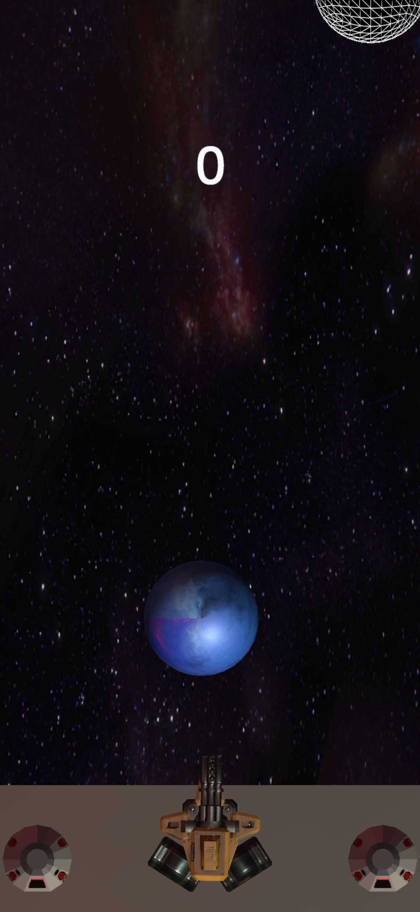

# shootTheBall
A Shooting Game by Unity.
The programming language is  C#.

Singleton and Object pooling Concept improve the run time of the game.

You can Find the code,which is written by C# in the following path: shootTheBall/Assets/FREE GatlingGun/Turrets/Gatling Gun/Scripts/
